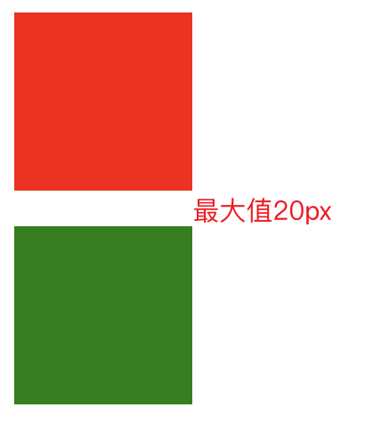
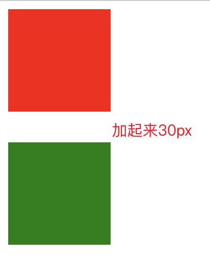
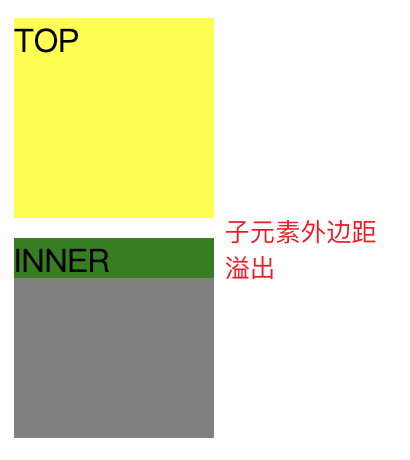
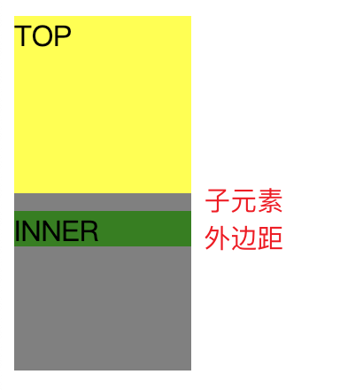

## 一、什么是BFC
> 块级格式化上下文，用于决定块级盒的布局及浮动相互影响范围的一个区域
- 来源于视觉格式化模型，视觉格式化模型定义了盒子的计算规则，盒子的尺寸，类型，定位，盒子的子元素或兄弟元素，视口的尺寸和位置

- 1. BFC 内部的块级盒会在垂直方向上一个接一个排列
- 2. 同一个 BFC 下的相邻块级元素可能发生外边距折叠，创建新的 BFC 可以避免的外边距折叠
- 3. 每个元素的外边距盒（margin box）的左边与包含块边框盒（border box）的左边相接触（从右向左的格式化，则相反），即使存在浮动也是如此
- 4. 浮动盒的区域不会和 BFC 重叠
- 5. 计算 BFC 的高度时，浮动元素也会参与计算
## 二、创建BFC
- 1. 根元素（\<html>）
- 2. 浮动元素（float 不为 none）
- 3. 绝对定位元素（position 为 absolute 或 fixed）
- 4. 表格的标题和单元格（display 为 table-caption，table-cell）
- 5. 匿名表格单元格元素（display 为 table 或 inline-table）
- 6. 行内块元素（display 为 inline-block）
- 7. overflow 的值不为 visible 的元素
- 8. 弹性元素（display 为 flex 或 inline-flex 的元素的直接子元素）
- 9. 网格元素（display 为 grid 或 inline-grid 的元素的直接子元素）
## 三、BFC范围
- BFC包含创建它的元素的所有子元素，但是不包括创建了新的BFC的子元素的内部元素，隔离思想
## 四、BFC应用
- 1. 自适应两栏布局（基于特性4）
  - 左侧内容撑开，右侧自适应
  - 实现：左侧float，右侧开启BFC
  
  ```html
  <style>
    * {
      padding: 0px;
      margin: 0px;
    }
    .left {
      float: left;
      height: 100vh;
      margin-right: 10px;
      background-color: red;
    }
    .right {
      overflow: hidden;
      height: 100vh;
      background-color: green;
    }
  </style>
  <body>
    <div>
      <div class="left">左侧内容撑开</div>
      <div class="right">右侧自适应</div>
    </div>
  </body>
  ```
- 2. 防止外边距折叠
  - 2.1 兄弟元素外边距重叠
    - 默认情况下会取最大的外边距作为两个元素的外边距
    - 创建新的BFC避免外边距折叠  
    
    
  ```html
  <style>
    .parent {
      overflow: hidden; // 创建BFC避免兄弟元素外边距折叠
    }
    .child1 {
      width: 100px;
      height: 100px;
      margin-bottom: 10px;
      background-color: red;
    }
    .child2 {
      width: 100px;
      height: 100px;
      margin-top: 20px;
      background-color: green;
    }
  </style>
  <body>
    <div class="parent">
      <div class="child1"></div>
    </div>
    <div class="parent">
      <div class="child2"></div>
    </div>
  </body>
  ```
  - 2.2 父子元素外边距重叠
    - 父元素与其第一个或最后一个子元素之间不存在边框、内边距、行内内容，且没有创建BFC将两者的外边距分开，子元素的外边距会溢出到父元素外面  
    
    
  ```html
  <style>
    .top {
      width: 100px;
      height: 100px;
      background: yellow;
    }
    .outer {
      background: gray;
      width: 100px;
      height: 100px;
      overflow: auto; /* 给父元素触发BFC */
    }

    .inner {
      width: 100px;
      height: 20px;
      margin: 10px 0; /* 这里设置了inner box的 margin，很明显没有生效 */
      background: green;
    }
  </style>
  <body>
    <div class="top">TOP</div>
    <div class="outer">
      <div class="inner">INNER</div>
    </div>
  </body>
  ```
- 3. 清除浮动
```html
<style>
  .box {
    float: left;
    width: 100px;
    height: 180px;
    margin: 10px;
    background: cyan;
  }

  .bfc {
    /* 计算 BFC 高度时，浮动元素也会参与计算，可以利用这一点清除 BFC 内部的浮动 */
    overflow: auto;
    min-height: 50px;
    background: gray;
  }
</style>
<body>
  <div class="bfc">
    <div class="box"></div>
    <div class="box"></div>
    <div class="box"></div>
  </div>
</body>
```
