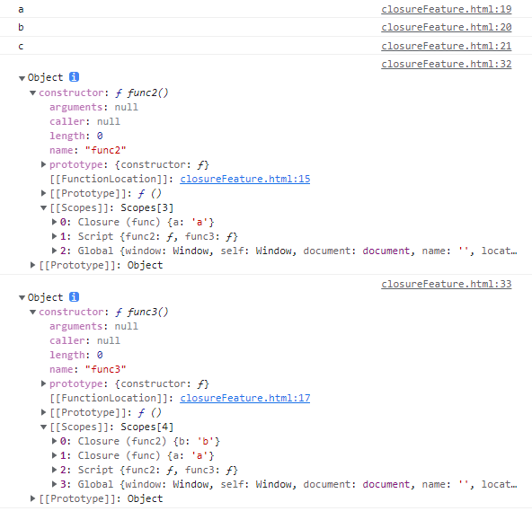

## 一、闭包
### 1. 什么是闭包？
- 闭包是返回函数的时候扫描函数内的标识符引用，把用到的本作用域的变量打成闭包，放到了一个特殊的属性（**[[Scopes]]**）里，是作用域的子集
### 2. 为什么会有闭包？
- 变量和函数按照作用域规则（顺序）访问，当内部函数返回一个函数或者在作用域之外可以被访问，外层作用域调用完毕后应该被销毁，外层销毁之后内层作用域怎么处理，因此创建了闭包用来保存子作用域需要用到的父作用域中的引用
### 3. 闭包是怎么设计的
- 设置了一个特殊的属性[[Scopes]]（栈结构）用来保存当前函数需要用到的外部引用
- 通过过滤规则保存
	- 必须包含全局作用域
	- 其他作用域中的变量根据是否引用来保存，引用的保存，不引用的不保存
### 4. 闭包的常见使用场景
- **使用了回调函数就是在使用闭包**
- 定时器
- 事件监听器
- Ajax请求
- 跨窗口通信
- web workers
- 防抖
- 模块
 ### 5. 闭包的优缺点
- 优点
	- 避免过度使用全局变量，防止全局变量污染
- 缺点
	- 一直保留这闭包会对内存造成内存持续消耗，继而影响处理速度，代码性能
## 二、面试题
### 1. 看看[[Scopes]]
```JavaScript
function func() {
	const a = 'a'
	function func2() {
		const b = 'b'
		function func3() {
			const c = 'c'
			console.log(a)
			console.log(b)
			console.log(c)
		}
		return func3
	}
	return func2
}

const func2 = func()
const func3 = func2()

func3()
console.log(func2.prototype);
console.log(func3.prototype);
```
