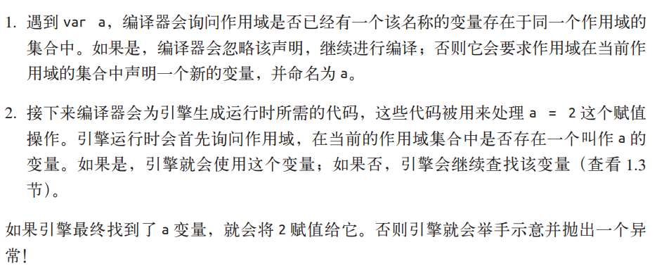

## 开始之前
### 1. 程序的执行过程？
- **分词/词法分析**：将代码切割成一块一块的词法单元，比如：var a = 2就会被切割成 var、a、=、2
- **解析/语法生成**：将词法单元转换成AST（机器指令），也就是抽象语法树
- **代码生成**：把AST转换为可执行代码
### 2. 谁来做这些事？
- **引擎**：负责代码的编译和执行
- **编译器**：负责语法分析和代码生成
- **作用域**：负责收集和维护标识符（变量、函数等）的查询规则

### 3. 引用《你不知道的js上》

## 一、作用域
### 1. 什么是作用域？
- 一套确定在何处以及如何查找变量的规则
	- 以=为界，左边为容器，右边为值
	- **LHS**：根据值找容器，如变量赋值
  - **RHS**：根据容器找值，如调用函数，使用变量
### 2. 作用域分类？
- 词法作用域：由代码书写位置决定
```javascript
function foo(a) { // 1️⃣全局作用域，有一个标识符：foo
  var b = a * 2 // 2️⃣foo的作用域，有三个标识符：a，b，bar
  function bar(c) {
    console.log(a, b, c) // 3️⃣bar的作用域，有一个标识符：c
  }
  bar(b * 3)
}
foo(2)
```
- 全局作用域：作用域的最顶端
- 函数作用域：由函数开始的词法作用域，如foo，bar创造的标识符都只能在本函数或本函数的下级作用域中使用
- 块级作用域（es6新增）：由{}包裹的词法作用域
  - 注意：if、for后面跟的{}不能看作代码块，使用var声明的变量由于变量提升在作用域的上级作用域仍然可以访问
```javascript
var foo = true
if (foo) {
  let bar = foo * 2
}
console.log(bar) // 全局作用域中仍然能访问到bar
```
### 3. 什么是作用域链？
- 查询变量会首先在自己的作用域中查找，如果没有查找到，回再向上一级查找，查找过程形成的链条就是作用域链

## 二、作用域引发的异常
### 1. ReferenceError
- 解释：引用错误
- 原因：
  - ①RHS在整条作用域链中没有查找到这个变量的值
  - ②LHS在整条作用域链中没有查找到目标变量，严格状态下会抛出ReferenceError，非严格状态会自动创建一个变量
### 2. TypeError
- 解释：类型错误
- 原因：RHS查询到了，但是企图对这个变量进行一些不允许的操作，比如引用undefined的属性
### 3. 两者区别
- ReferenceError：作用域判别失败
- TypeError：作用域判别成功，但是违规操作

## 三、提升
### 1. 什么是提升？
- 现有声明，后有赋值，编译器会把所有的声明提升到所在作用域的顶部
### 2. 哪些声明？（函数和变量）
- 先提函数，后提变量
- 函数声明会被提升，函数表达式不会
  - 函数声明：function是声明中的第一个词
  - 函数表达式：不由function开始
### 3. 新增声明方式
- es6新增了let和const替代var，他们**不可以重复声明**且**不会提升**
  - let：声明变量，替代var
  - const：声明常量，值不可变，但是如果是个对象，则是引用不可变，存的值可以修改
