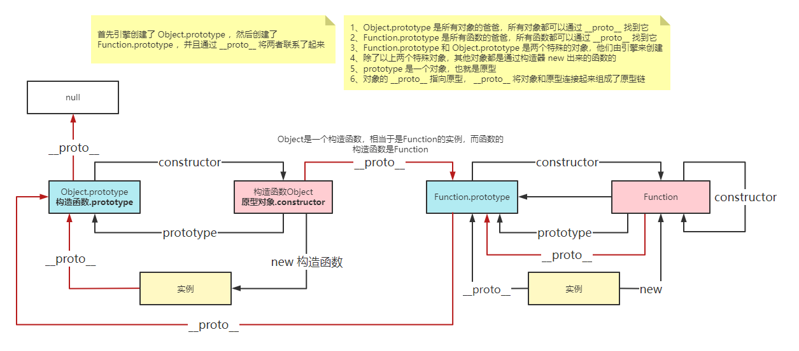

## 一、什么是原型(prototype)？
- 原型指的是原型对象，创建的函数中都会有prototype属性，这个属性是一个指针，指向一个对象(**`原型对象`**)，原型对象里面包含由特定类型的所有实例共有的属性和方法；
## 二、什么是原型链？
- 模拟实现继承
### 1.	原型链第一层
- new一个函数就会根据规则给这个函数创建一个原型属性prototype，指向函数的原型对象；
- 原型对象里面会自动添加一个constructor属性，指向构造函数；
- 每个实例都有一个隐式引用（\_\_proto__），指向他的原型对象。
  - 模拟实现new
```JavaScript
// 1. 创建了一个新对象
// 2. 给这个对象添加__proto__并且指向他的构造函数对应的prototype对象
// 3. 将this指向这个对象
// 4. 返回这个对象
function n() {
  let obj = {} // 1
  Constructor = [].shift.call(arguments) // 取出传入的第一个参数
  obj.__proto__ = Constructor.prototype // 2
  let ret = Constructor.apply(obj, arguments) // 3
  return ret === 'Object' ? ret : obj // 4
}

function test(a) {
  this.a = a
}
```

### 2. 整个原型链
- **原型链描述的是实例与原型的关系**
- 如上所述，实例通过__proto__指向的原型对象又是另一个类型的实例，有\_\_proto__指针指向自己的原型对象，这个原型对象同样也有自己的__proto__，指向自己的原型对象，由于js中万物皆对象，所以原型链的最高层是Object.prototype，Object.prototype.__proto__为null，这条由__proto__串起来的链就是原型链

### 3. Function和Object的蜜汁关系
- Function：函数的构造函数
- Object：对象的构造函数
- **Object.prototype & Function.prototype**
  - 都是引擎创建的，引擎先创建了Object.prototype，接着又创建了Function.prototype，又通过__proto__将两者联系起来（**Function.prototype.__proto__ === Object.prototype→true**）
- **Function.prototype & Function.__proto__**
  - 先有prototype再有构造函数，所有构造函数都可以通过原型链找到Function.prototype，Function本身也是一个函数，所以将Function.__proto__也指向了Function.prototype（**Function.prototype === Function.__proto__→true**）
- **Object.constructor & Function.prototype**
  - function Object是一个构造函数，相当于是function Function的实例，所以实例的__proto__指向他的原型对象，也就是Function.prototype（**Object.constructor === Function.prototype→true**）

## 三、相关问题
### 1. instanceof
<!-- TODO -->
### 2.继承
<!-- TODO -->