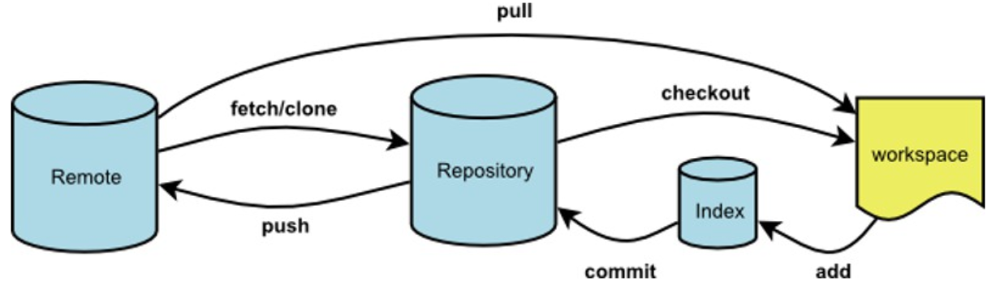

## 一、.gitignore不起作用
- 原因：.gitignore只能忽略原先没有被track的文件，如果文件已经被加入到了版本管理中，再去添加.gitignore是不起作用的
- 解决：
```JavaScript
git rm -r -cached . // 清除本地当前缓存
git add . // 重新添加到暂存区
git commit -m '更新' // 重新提交
```
## 二、git pull 和 git fetch 的区别
- 
- git pull：从远程获取最新版本并merge到本地
- git fetch：从远程获取最新版本但是不自动merge

## 三、git stash保存暂存区，切换到另一个分支后出现冲突
- 创建一个新的分支`git checkout -b newBranch`
- 将当前未提交到本地（和服务器）的代码推入到Git的栈中`git stash`
- 清空Git栈`git stash clear`

## 四、撤销
- 撤销一个提交
  - `撤销：git reset --soft HEAD^`
  - `还原：git revert -m l HEAD`
- 撤销合并或拉动
  - `git reset --hard`
- 本次提交跟上次使用同样的描述
  - `git commit --amend`
