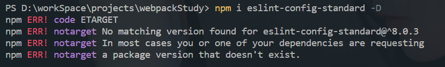

## 一、npm i 安装eslint-config-standard失败

- 解决方法
  - `npm view eslint-config-standard`
  - `npm i https://registry.npmjs.org/eslint-config-standard/-/eslint-config-standard-16.0.3.tgz`
## 二、npm查看源地址及更换源地址
### 1. npm
- 查看源地址：`npm config get registry`
- 设置源地址：`npm config set registry 新地址`
### 2. nrm
- 全局安装nrm：`npm i -g nrm`
- 添加源：`nrm add 源名 源地址`
- 切换源：`nrm use 源名`
- 查看当前源：`nrm ls`
## 三、npm、nvm、nrm、npx、pnpm
### 1. npm（Node Package Manager）
- node包管理器
### 2. nvm（Node.js version manager）
- node版本控制
- nvm常用命令
  - 安装指定版本：`nvm install 版本号`
  - 删除指定版本：`nvm uninstall 版本号`
  - 切换版本：`nvm use 版本号`
  - 查看本地安装的版本：`nvm ls`
### 3. nrm（NPM registry manager）
- npm源地址管理
- nrm常用命令
  - 显示所有镜像源：`nrm ls`
### 4. npx（npm包执行器）
- 特点
  - 临时安装可执行依赖包，不用全局安装，不用担心长期的污染。
  - 可以执行依赖包中的命令，安装完成自动运行。
  - 自动加载 node_modules 中依赖包，不用指定 $PATH 。
  - 可以指定 node 版本、命令的版本，解决了不同项目使用不同
- 执行流程
  - 到 node_modules/.bin 路径检查对应的命令是否存在，找到之后执行；
  - 没有找到，就去环境变量 $PATH 里面，检查对应命令是否存在，找到之后执行;
  - 还是没有找到，自动下载一个临时的依赖包最新版本在一个临时目录，然后再运行命令，运行完之后删除，不污染全局环境。
### 5. pnpm（包管理器）
- 优势
  - 安装速度快
  - 高效利用磁盘空间
- 安装：`npm i -g pnpm`
- 安装依赖：`pnpm i`
- 卸载：`npm rm -g pnpm`
