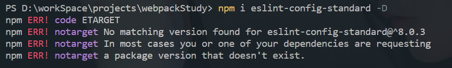

## 一、npm i 安装eslint-config-standard失败

- 解决方法
  - `npm view eslint-config-standard`
  - `npm i https://registry.npmjs.org/eslint-config-standard/-/eslint-config-standard-16.0.3.tgz`
## 二、npm查看源地址及更换源地址
### 1. npm
- 查看源地址：`npm config get registry`
- 设置源地址：`npm config set registry 新地址`
### 2. nrm
- 全局安装nrm：`npm i -g nrm`
- 添加源：`nrm add 源名 源地址`
- 切换源：`nrm use 源名`
- 查看当前源：`nrm ls`
## 三、npm、nvm、nrm
### 1. npm（Node Package Manager）
- node包管理器
### 1. nvm（Node.js version manager）
- node版本控制
- nvm常用命令
  - 安装指定版本：`nvm install 版本号`
  - 删除指定版本：`nvm uninstall 版本号`
  - 切换版本：`nvm use 版本号`
  - 查看本地安装的版本：`nvm ls`
### 三、nrm（NPM registry manager）
- npm源地址管理
- nrm常用命令
  - 显示所有镜像源：`nrm ls`
