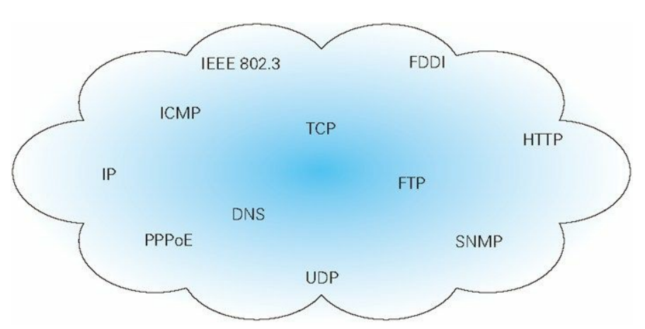
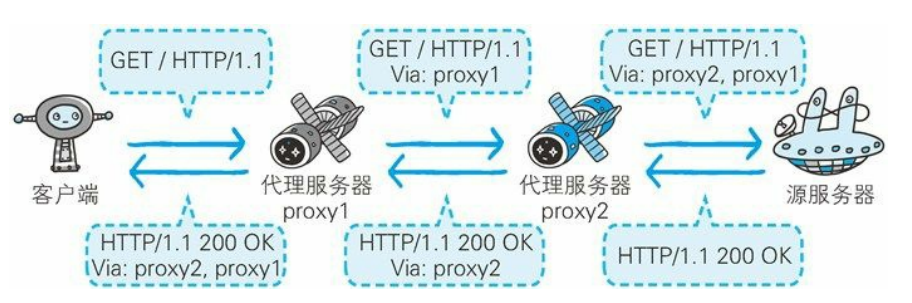
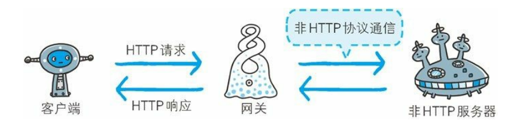
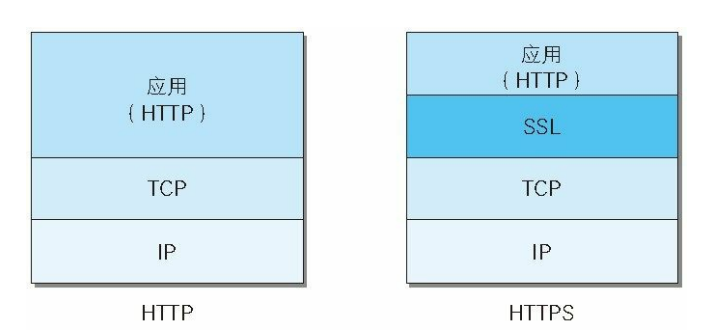

## 一、TCP/IP协议族
### 1. 协议
- 规则，规定了从电缆的规格到IP地址的选定方法、寻找异地用户的方法、双方建立通信的顺序，以及Web页面显示需要处理的步骤等。
### 2. TCP/IP协议
- 与互联网相关的协议的集合。

### 3. TCP/IP协议的分层管理
- #### 应用层
   - 决定了向用户提供服务时通信的活动。
   - 包含**FTP**(File Transfer Protocol，文本传输协议)，**DNS**(Domain Name System，域名系统)，**HTTP**(HyperText Transfer Protocol，超文本传输协议)。
- #### 传输层
   - 对应用层提供网络连接中的两台计算机之间的数据传输。
   - 包含**TCP**(Transmission Control Protocol，传输控制协议)，**UDP**(User Data Protocol，用户数据报协议)。
- #### 网络层(网络互连层)
   - 处理在网络上流动的数据包，规定通过怎样的传输路线到达对方计算机。
   - 包含**IP**(Internet Protocol，网际协议)。
- #### 链路层(数据链路层，网络接口层)
   - 处理连接网络的硬件部分。
   - 包括控制操作系统、硬件的设备驱动、NFC，光纤等物理可见设备。

### 4. 与HTTP相关的协议：IP、TCP、DNS
- #### IP协议负责传输
   - 处于网络层，作用是把各种数据包传递给对方，并确定传送成功。
   - 保证成功传送的重要的两个条件：IP地址和MAC地址(Media Access Control Address)。
   - 通常通信的双方不在一个局域网内,需要通过多台计算机和网络设备进行中转才可实现连接,进行中转时, 会利用下一台中转设备的MAC地址来搜索下一个中转目标，设备使用ARP协议(Address Resolution Protocol)解析IP地址反查出对应的MAC地址
- #### TCP协议确保可靠
   - TCP协议处于传输层, 提供可靠的字节流服务.
   - **TCP三次握手建立连接**   
   **第一次握手**: 发送端发送一个带有**SYN**(synchronize, 同步处理标志)的数据包到接收端.  
   **第二次握手**: 接收端收到数据包后, 回传一个带有**ACK**(acknowledgement, 确认标志)的数据包, 表示确认收到发送端第一次握手时发送的数据包.  
   **第三次握手**: 发送端再回传一个带有ACK标志的数据包, 表示握手结束.
   - **TCP四次挥手断开连接**  
	**第一次挥手**：接收端发送一个FIN(finish结束标志)，用来关闭发送端与接收端的数据传送。  
	**第二次挥手**：发送端收到这个FIN，它发回一个ACK，确认序号为收到的序号加1。和SYN一样，一个FIN将占用一个序号。  
	 **第三次挥手**：发送端关闭与接收端的连接，发送一个FIN给接收端。  
	 **第四次挥手**：接收端发回ACK报文确认，并将确认序号设置为收到序号加1。
- #### DNS服务解析域名
   - 提供域名到IP地址之间的解析作用，通过域名查找IP地址或通过IP地址反查域名
### 5. **输入一个URL到生成页面经历了什么**
> 1. **DNS 解析:将域名解析成 IP 地址**
> 2. **TCP 连接：TCP 三次握手之后确定可以进行数据的传输**  
   2.1 第一次握手: 客户端发送一个带有SYN(synchronize, 同步处理标志)的数据包到服务器端.  
   2.2 第二次握手: 服务器端收到数据包后, 回传一个带有ACK(acknowledgement, 确认标志)的数据包, 表示确认收到客户端第一次握手时发送的数据包.  
   2.3 第三次握手: 客户端再回传一个带有ACK标志的数据包, 表示握手结束.
> 3. **客户端发送 HTTP 请求(对应前端)：构建HTTP请求报文并通过TCP协议发送到服务器指定端口**
> 4. **服务器端处理请求并返回 HTTP 报文(对应后端)：在固定的端口接收到TCP报文后，对HTTP协议进行解析，按照报文格式进一步封装成HTTP Request对象**
> 5. **浏览器解析报文渲染页面**  
   5.1 解析HTML文件生成DOM树  
   5.2 解析CSS文件生成CSSOM（CSS Object Model）  
   5.3 将DOM树和CSS渲染树合并成一个渲染树  
   5.4 根据渲染树来布局（layout），计算每个节点的几何信息  
   5.5 将各个节点绘制（paint）在屏幕上  
> 6. **断开连接：TCP 四次挥手**  
   6.1 第一次挥手：客户端发送一个FIN(finish结束标志)，用来关闭客户端与服务器端的数据传送。  
   6.2 第二次挥手：服务器端收到这个FIN，发回一个ACK，确认序号为收到的序号加1。和SYN一样，一个FIN将占用一个序号。  
   6.3 第三次挥手：服务器端关闭与客户端的连接，发送一个FIN给客户端。   
   6.4 第四次挥手：客户端发回ACK报文确认，并将确认序号设置为收到序号加1。  
## 二、HTTP协议
> 用于HTTP协议交互的信息被称为HTTP报文，客户端发送的叫做请求报文；服务器端发送的叫做响应报文  
> 报文：HTTP通信中的基本单位，由八位组字节流组成，基本由**报文首部+报文主体**两部分构成   
> 实体：请求或相应的有效载荷数据，由实体首部和实体主体组成  
> 报文主体=实体主体，传输中进行编码操作时，实体主体内容会发生变化，他们才会产生差异
### 1. 请求报文
- 构成：请求方法, 请求URI, 协议版本, 可选的请求首部字段, 内容实体

- 请求方法  

|方法|说明|支持的HTTP协议版本|
|:-:|:-:|:-:|
|GET|获取资源|1.0、1.1|
|POST|传输实体主体|1.0、1.1|
|PUT|传输文件|1.0、1.1|
|HEAD|获得报文首部|1.0、1.1|
|DELETE|删除文件|1.0、1.1|
|OPTIONS|询问支持的方法|1.1|
|TRACK|追踪路径|1.1|
|CONNECT|要求用隧道协议连接代理|1.1|
|LINK|建立和资源之间的联系|1.0|
|UNLINK|断开连接关系|1.0|
- 请求首部

|名称|内容|
|:-:|:-:|
|请求行|请求方法、请求URI、HTTP版本|
|**请求首部字段**|从客户端向服务器端发送请求报文时使用的首部。补充了请求的附加内容、客户端信息、响应内容相关优先级等信息|
|通用首部字段|请求报文和响应报文两方都会使用的首部|
|实体首部字段|针对请求报文和响应报文的实体部分使用的首部。补充了资源内容更新时间等与实体有关的信息|
|其他||

> 问：get请求和post请求有什么区别？
### 2. 响应报文
- 构成：协议版本, 状态码, 状态码的解释说明文字, 可选的响应首部字段, 实体主体构成

- 状态码：反馈从服务器端返回的请求结果 
   - 概述

   ||类别|原因短语|
   |:-:|:-:|:-:|
   |1XX|Informational(信息性状态码)|接收的请求正在处理|
   |2XX|Success(成功状态码)|请求正常处理完毕|
   |3XX|Redirection(重定向状态码)|需要进行附加操作以完成请求|
   |4XX|Client Error(客户端错误状态码)|服务器无法处理请求|
   |5XX|Server Error(服务器端错误状态码)|服务器处理请求出错|
   - 详细  

   
- 响应首部

|名称|内容|
|:-:|:-:|
|状态行|HTTP版本、状态码(数字和原因短语)|
|**响应首部字段**|从服务器端向客户端返回响应报文时使用的首部。补充了响应的附加内容，也会要求客户端附加额外的内容信息|
|通用首部字段|请求报文和响应报文两方都会使用的首部|
|实体首部字段|针对请求报文和响应报文的实体部分使用的首部。补充了资源内容更新时间等与实体有关的信息|
|其他||
### 3. Cookie
`首部：Set-Cookie || Cookie`
- HTTP是无状态协议, 不对之前发生过的请求和响应的状态进行管理, 无法保存用户的登录信息, Cookie技术通过在请求和响应报文中添加Cookie信息来控制客户端的状态.
- Cookie的添加过程
   - 无Cookie时
      - (1). 客户端发送请求
      - (2). 服务器端在响应中添加Cookie后发送响应
   - 有Cookie时
      - (3). 客户端在请求中添加Cookie后发送请求
      - (4). 服务器端检查Cookie是否是是刚才发的那个，并且发送响应
- **Set-Cookie**

属性|说明
:-:|:-:
NAME=VALUE|赋予 Cookie 的名称和其值（必需项）
expires=DATE|Cookie 的有效期（若不明确指定则默认为浏览器关闭前为止）
path=PATH|将服务器上的文件目录作为Cookie的适用对象（若不指定则默认为文档所在的文件目录）
domain=域名|作为 Cookie 适用对象的域名 （若不指定则默认为创建 Cookie的服务器的域名）
Secure|仅在 HTTPS 安全通信时才会发送 Cookie
HttpOnly|加以限制，使 Cookie 不能被 JavaScript 脚本访问，目的在于防止跨站脚本攻击（Cross-sitescripting，XSS）对 Cookie 的信息窃取

- **Cookie**
   - 告知服务器，当客户端想获得 HTTP 状态管理支持时，就会在请求中包含从服务器接收到的 Cookie
## 三、首部
### HTTP/1.1首部字段
#### 1. 通用首部
首部字段名|说明
:-:|:-:
Cache-Control|控制缓存的行为
Connection|逐跳首部、连接的管理
Date|创建报文的日期时间
Pragma|报文指令，属于通用首部字段，但只用在客户端发送的请求中。客户端会要求所有的中间服务器不返回缓存的资源。只有一个值 no-cache
Trailer|报文末端的首部一览`Trailer: Expires`
Transfer-Encoding|指定报文主体的传输编码方式，HTTP/1.1 的传输编码方式仅对分块传输编码有效
Upgrade|升级为其他协议，用于检测 HTTP 协议及其他协议是否可使用更高的版本进行通信，其参数值可以用来指定一个完全不同的通信协议。用于检测 HTTP 协议及其他协议是否可使用更高的版本进行通信，其参数值可以用来指定一个完全不同的通信协议
Via|代理服务器的相关信息，追踪客户端与服务器之间的请求和响应报文的传输路径
Warning|错误通知，Warning: [警告码][警告的主机:端口号]“[警告内容]”([日期时间])
- **Cache-Control**
   - 用途：操作缓存
   - 缓存请求

   指令|参数|说明|客户端|服务器端
   :-:|:-:|:-:|:-:|:-:
   no-cache|无|强制向源服务器再次验证|客户端将不会接收缓存过的响应|缓存服务器不能对资源进行缓存。源服务器以后也将不对缓存服务器请求中提出的资源有效性进行确认，且禁止其对响应资源进行缓存操作
   no-store|无|不缓存请求或响应的任何内容|暗示请求包含机密信息|暗示响应中包含机密信息
   max-age = [ 秒]|必需|响应的最大Age值
   max-stale( = [ 秒])|可省略|接收已过期的响应
   min-fresh = [ 秒]|必需|期望在指定时间内的响应仍有效
   no-transform|无|代理不可更改媒体类型，可防止缓存或代理压缩图片等类似操作
   only-if-cached|无|从缓存获取资源，若发生请求缓存服务器的本地缓存无响应，则返回状态码 504 Gateway Timeout
   cache-extension|-|新指令标记（token）
   - 缓存响应

   指令|参数|说明
   :-:|:-:|:-:
   public|无|可向任意方提供响应的缓存
   private|可省略|仅向特定用户返回响应
   no-cache|可省略|缓存前必须先确认其有效性
   no-store|无|不缓存请求或响应的任何内容
   no-transform|无|代理不可更改媒体类型
   must-revalidate|无|可缓存但必须再向源服务器进行确认
   proxy-revalidate|无|要求中间缓存服务器对缓存的响应有\效性再进行确认
   max-age = [ 秒]|必需|响应的最大Age值
   s-maxage = [ 秒]|必需|公共缓存服务器响应的最大Age值
   cache-extension|-|新指令标记（token）
- **Connection**
   - 控制不再转发给代理的首部字段
   `Connection: 不再转发的首部字段名`
   - 管理持久链接
      - HTTP/1.1之前默认非持久连接，想要持续连接：`Connection: Keep-Alive`
      - HTTP/1.1默认持久连接，想要断开服务器和客户端的连接：`Connection: close`
   
#### 2. 请求首部
> 客户端 -> 服务器 用于补充请求的附加信息、客户端信息、对响应内容相关的优先级等内容
首部字段名|说明
:-:|:-:
Accept|通知服务器，用户代理能够处理的媒体类型及媒体类型的相对优先级
Accept-Charset|通知服务器用户代理支持的字符集及字符集的相对优先顺序
Accept-Encoding|告知服务器用户代理支持的内容编码及内容编码的优先级顺序
Accept-Language|优先的语言（自然语言）
Authorization|Web认证信息,告知服务器，用户代理的认证信息（证书值）
Expect|期待服务器的特定行为，告知服务器，期望出现的某种特定行为 `Expect: 100-continue`
From|用户的电子邮箱地址，显示搜索引擎等用户代理的负责人的电子邮件联系方式
Host|请求资源所在服务器，告知服务器，请求的资源所处的互联网主机名和端口号
If-Match|比较实体标记（ETag），服务器会比对 If-Match 的字段值和资源的 ETag 值，仅当两者一致时，才会执行请求。反之，则返回状态码 412 Precondition Failed 的响应
If-Modified-Since|比较资源的更新时间，在 If-Modified-Since 字段指定的日期时间后，资源发生了更新，服务器会接受请求，否则则返回状态码 304 Not Modified
If-None-Match|比较实体标记（与 If-Match 相反）,在 If-None-Match 的字段值与 ETag 值不一致时，可处理该请求。与 If-Match 首部字段的作用相反
If-Range|资源未更新时发送实体 Byte 的范围请求，与Etag时间一致时，作为范围请求处理，否则返回全体资源
If-Unmodified-Since|比较资源的更新时间（与If-Modified-Since相反）
Max-Forwards|最大传输逐跳数，每次转发数值减 1。当数值变 0 时返回响应
Proxy-Authorization|代理服务器要求客户端的认证信息
Range|实体的字节范围请求
Referer|告知服务器请求的原始资源的 URI
TE|传输编码的优先级，告知服务器客户端能够处理响应的传输编码方式及相对优先级。它和首部字段 Accept-Encoding 的功能很相像，但是用于传输编码
User-Agent|HTTP 将创建请求的浏览器和用户代理名称等信息传达给服务器
- **Accept**
   - 文件类型
      - 文本文件：`ext/html, text/plain, text/css ...    application/xhtml+xml, application/xml ...`
      - 图片文件：`image/jpeg, image/gif, image/png ...`
      - 视频文件：`video/mpeg, video/quicktime ...`
      - 应用程序使用的二进制文件：`application/octet-stream, application/zip ...`
   - 设置权重
      - `;q=number, number: [0, 1] 数值精确到小数点后三位，默认权重为1.0，权重越高越优先返回`
- **Accept-Encoding**
   - gzip：gzip Lempel-Ziv算法
   - compress：Lempel-Ziv-Welch算法
   - deflate：zlib格式 deflate压缩算法
   - identity：不执行压缩或不会变化的默认编码格式
- **Range**
   > 场景：用户下载到一半突然断网，就得重头下载的状况，产生了恢复机制，也就是从指定范围发出请求，称之为范围请求
   - 5001~10000字节：Range: bytes=5001-10000
   - 5001字节之后的：Range: bytes=5001-
   - 一开始到3000和5000~7000字节：Range: bytes=-3000, 5000-7000

#### 3. 响应首部
> 服务器 -> 客户端 用于补充响应的附加信息、服务器信息以及对客户端的附加要求等
首部字段名|说明
:-:|:-:
Accept-Ranges|是否接受字节范围请求，可处理范围请求时指定其为 bytes，反之则指定其为 none
Age|推算资源创建经过时间，告知客户端，源服务器在多久前创建了响应。字段值的单位为秒
ETag|资源的匹配信息
Location|令客户端重定向至指定URI，配合 3xx ：Redirection 的响应，提供重定向的URI
Proxy-Authenticate|代理服务器对客户端的认证信息
Retry-After|对再次发起请求的时机要求，告知客户端应该在多久之后再次发送请求。主要配合状态码 503 Service Unavailable 响应，或 3xx Redirect 响应一起使用
Server|HTTP服务器的安装信息
Vary|代理服务器缓存的管理信息
WWW-Authenticate|服务器对客户端的认证信息
- **ETag**
   - 资源被缓存时，会被分配一个ETag
   - 强ETag：不论实体发生多么细微的变化都会改变其值
   - 弱ETag：只用于提示资源是否相同。只有资源发生了根本改变，产生差异时才会改变 ETag 值。这时，会在字段值最开始处附加 W/
#### 4. 实体首部
> 包含在请求报文和响应报文中的实体部分所使用的首部，用于补充内容的更新时间等与实体相关的信息
首部字段名|说明
:-:|:-:
Allow|资源可支持的HTTP方法，当服务器接收到不支持的 HTTP 方法时，会以状态码405 Method Not Allowed 作为响应返回
Content-Encoding|实体主体适用的编码方式，gzip、compress、deflate、identity
Content-Language|实体主体的自然语言
Content-Length|实体主体的大小（单位：字节）
Content-Location|替代对应资源的URI，报文主体返回资源对应的 URI
Content-MD5|实体主体的报文摘要，检查报文主体在传输过程中是否保持完整，以及确认传输到达
Content-Range|实体主体的位置范围
Content-Type|实体主体的媒体类型
Expires|实体主体过期的日期时间，在Expires 字段值指定的时间之前，响应的副本会一直被保存。当超过指定的时间后，缓存服务器在请求发送过来时，会转向源服务器请求资源
Last-Modified|资源的最后修改日期时间

- **Content-Type**
   - multipart/form-data：web表单文件上传时使用
   - multipart/byteranges：状态码206响应报文包含了多个范围的内容时使用

### 非HTTP/1.1首部字段
#### 1. End-to-end 端到端首部
- 必须转发给请求/响应对应的最终接收目标，必须保存在由缓存生成的响应中
#### 2. Hop-by-hop 逐跳首部
- 单次转发有效，会因为缓存或代理而不再转发，需要通过Connection字段使用
- 八个逐跳首部
   - Connection
   - Keep-Alive
   - Proxy-Authenticate
   - Proxy-Authorization
   - Trailer
   - TE
   - Transfer-Encoding
   - Upgrade
### 3. 内容协商
- 类型
   - 服务器驱动协商
   - 客户端驱动协商
   - 透明协商
- Accept
- Accept-Charset
- Accept-Encoding
- Accept-Language
- Content-Language
## 四、web服务器
### 1. 客户端和服务器之间的数据转发
- 代理：有转发功能的应用程序

   - Via首部字段标记经过的主机信息
- 网关：转发其他服务器通信数据的服务器

   - 利用网关可以由 HTTP 请求转化为其他协议通信
   - 提高通信的安全性
- 隧道：连接距离较远的客户端和服务器的应用程序

   - SSL加密手段
## 五、HTTPS
### 1. HTTP的缺点
- 通信使用明文，内容可能会被监听
   - 解决
      - 通信方式加密：HTTP+SSL||TLS
      - 内容加密：报文主体加密，要求通信双方有加密解密机制
- 不验证通信方的身份，有可能遭遇伪装
   - 引发：**Dos攻击（拒绝服务攻击）**
   - 解决
      -  查明对手的证书：SSL提供了证书可用于验证请求方
- 无法证明报文的完整性，有可能遭到篡改
   - 引发：**MITM（中间人攻击）**请求或响应在传输途中，遭攻击者拦截篡改内容的攻击
   - 解决
      - SSL提供认证和加密处理及摘要功能
### 2. HTTPS简介
> HTTPS=HTTP+加密+认证+完整性保护

### 3. HTTPS实现
- 两种加密方式
   - 共享密钥加密：加密和解密同用一个密钥，必须将密钥也发给通信方
   - 公开密钥加密：使用一对非对称的密钥。一把叫做私有密钥（private key），另一把叫做公开密钥（public key）。私有密钥不能让其他任何人知道，而公开密钥则可以随意发布，任何人都可以获得，使用对方的公开密钥加密，对方使用自己的私有密钥进行解密
- HTTPS使用的加密方式：公开+共享
   - 公开密钥加密安全的交换共享密钥加密中使用的密钥
   - 确保交换的密钥是安全的，使用共享密钥进行通信
