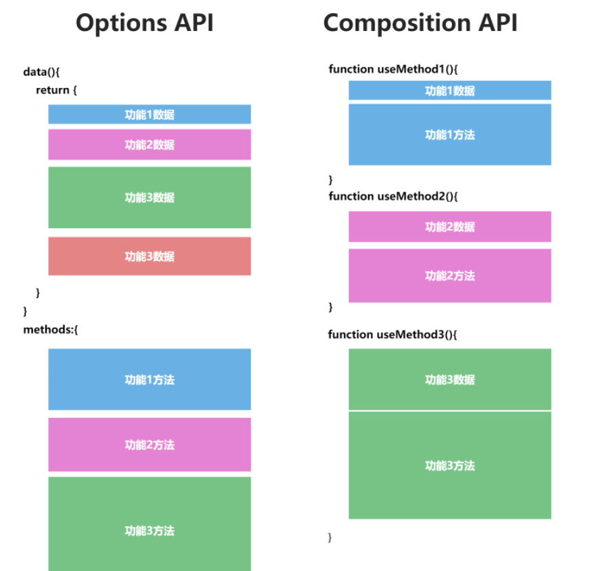
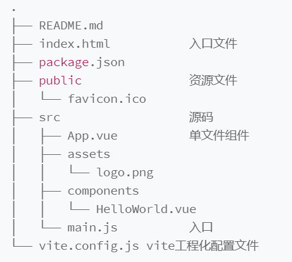
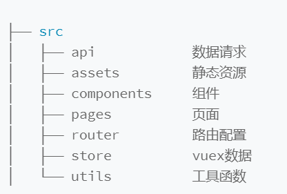
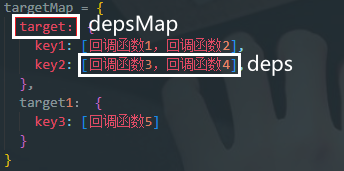

## 一、Vue2缺点
### 1. 开发维护
- 使用Flow.js做类型校验，Flow.js已不再维护，整个社区都在使用TypeScript来构建基础库
### 2. 社区的二次开发
- 内部运行时是直接执行浏览器API的，这样会在跨端方案中带来问题
### 3. 个人开发
- Option API 在组织代码较多组件的时候不易维护
- Vue2响应式并不是真正意义上的代理，而是基于 Object.defineProperty() 实现的
## 二、Vue3新特性
> **基于proxy的响应式系统、Composition API组合语法、新的组件、Vite、自定义渲染器、RFC机制、全部使用Typescript重构**
### 1. 基于proxy的响应式系统
- defineProperty vs proxy
- Vue2：defineProperty
  - defineProperty只能拦截data对象的属性，对于没有在data中定义的数据无法拦截
  - 对于数组的操作不会改变属性的指向
  ```js
  object.defineProperty(obj, 'title', {
    get() {},
    set() {}
  })
  ```
- Vue3：proxy
  - proxy拦截整个对象
  ```js
  new proxy(obj, {
    get() {},
    set() {}
  })
  ```
### 2. Composition API组合语法
  - 把各个功能的数据跟方法放在一起，便于复用

### 3. 新的组件
- Fragment: Vue 3 组件不再要求有一个唯一的根节点，清除了很多无用的占位 div。
- Teleport: 允许组件渲染在别的元素内，主要开发弹窗组件的时候特别有用。
- Suspense: 异步组件，更方便开发有异步请求的组件。
### 4. 工程化工具Vite
- 按需加载启动调试所需的资源
### 5. 自定义渲染器（跨端开发）
- Vue2：所有模块揉在一起
- Vue3：使用最近流行的 monorepo 管理方式进行拆包，使响应式、编译、运行时全部独立
  - monorepo
    - 在版本控制系统的单个代码库里包含了许多项目的代码。这些项目虽然有可能是相关的，但通常在逻辑上是独立的，并由不同的团队维护。
  - 渲染逻辑
    - 浏览器渲染API
    - 平台无关渲染逻辑
### 6. RFC机制
  - 社区生态更加丰富，更多人共同建设
### 7. 全部用Typescript重构
  - 类型系统带来了更方便的提示，并且让代码更健壮
## 三、Vue2升级到Vue3
[升级](https://gogocode.io/zh/docs/vue/vue2-to-vue3)
## 四、Vue3细节
### 1. Vue3生态
- 基于Node.js的工程化体系
- 上层开发工具：VScode+Volar拓展+语法提示工具
- 开发使用到的库：Vuex管理数据、Vue Router管理路由、CSS预处理stylus或sass、组件库Element3、网络请求工具axios、代码规范工具ESlint和Prettier、代码管理工具git
- 工程化工具：Vite
  - 创建Vue3项目：`npm init @vitejs/app`
  - 依赖安装：`npm i`
  - 启动项目：`npm run dev`
  - 安装vuex和vue router：`npm install vue-router@next vuex@next`
- 项目结构
  - 整体结构  
  -   
  - src结构
  - 
### 2. 应用开发
- 基础路由配置
- 页面编辑
- main.js中添加路由配置
- App.vue中渲染
## 五、vue3特点细节
### 1. 响应式

- proxy && value setter

原理|defineProperty|proxy|value setter
:-:|:-:|:-:|:-:
场景|Vue2 响应式|Vue3 reactive|Vue3 ref
优势|兼容性|基于proxy实现真正的拦截|实现简单
劣势|数组和属性删除等拦截不了|兼容不了IE11|只拦截了value属性
实际应用|Vue2|Vue3 复杂数据结构|Vue3 简单数据结构

- 使用
  - 通过 reactive 或者 ref 函数，把数据包裹成响应式对象，并且通过 effect 函数注册回调函数，然后在数据修改之后，响应式地通知 effect 去执行回调函数即可
- 实现
  - 基本知识
    - 对象描述符
    - Proxy
    - Reflect
    - 依赖地图  
    
  - **（1）reactive.js：return proxy**
  ```js
  import { mutableHandlers } from './baseHandlers'

  export reactive(target) {
    if (typeof target !== 'object') {
      console.warn(`reactive ${target} 必须是一个对象`)
      return target
    }
    // 通过Proxy代理对象target，mutableHandlers修改操作（这里指的是get和set）的默认行为，相当于在get和set前设置一层拦截
    return new Proxy(target, mutableHandlers)
  }
  ```
  - **（2）baseHandler.js：get取值：track依赖收集，set赋值：trigger触发更新**
  ```js
  import { reactive } from './reactive'
  import { track, trigger } from './effect'

  const get = createGetter()
  const set = createSetter()

  function createGetter(shallow = false) {
    return function get(target, key, receiver) {
      const res = Reflect.get(target, key, receiver) // 取值
      track(target, 'get', key) // 依赖收集
      if (typeof res === 'object') {
        return shallow ? res : reactive(res)
      }
    }
  }

  function createSetter() {
    return function set(target, key, value, receiver) {
      const res = Reflect.set(target, key, value, receiver) // 赋值
      trigger(target, 'set', key) // 触发更新
      return res
    }
  }

  export const mutableHandlers = { get, set }
  ```
  - **（3）effect.js：track函数、trigger函数、effect函数**
  ```js
  let activeEffect = null
  const targetMap = new weakMap()

  export function effect(fn, options = {}) {
    // effect嵌套，通过队列管理
    const effectFn = () => {
      try {
        activeEffect = effectFn
        // fn执行的时候，内部读取响应式数据
        fn()
      } finally {
        activeEffect = null
      }
    }
    if (!options.lazy) {
      effectFn()
    }
    effectFn.scheduler = options.scheduler
    return effectFn
  }

  export function track(target, type, key) {
    // 1、根据target找到对应的dep
    let depsMap = targetMap.get(target)
    if (!depsMap) {
      // 没找到dep，初始化
      targetMap.set(target, (depsMap = new Map()))
    }
    // 2、根据key获取effect
    let deps = depsMap.get(key)
    if (!deps) {
      // 没找到effect，初始化
      deps = new Set()
    }
    // 3、effect存在并且已经注册过，就添加到deps里面
    if (!deps.has(activeEffect) && activeEffect) {
      deps.add(activeEffect)
    }
    // 4、收集依赖
    depsMap.set(key, deps)
  }

  export function trigger(target, type, key) {
    // 1、根据target找到对应的dep
    const depsMap = targetMap.get(target)
    if (!depsMap) {
      return
    }
    // 2、根据key获取effect
    const deps = depsMap.get(key)
    if (!deps) {
      return
    }
    // 3、按照一定顺序执行effect
    deps.forEach((effectFn) => {
      if (effectFn.scheduler) {
        effectFn.scheduler
      } else {
        effectFn()
      }
    })
  }
  ```
